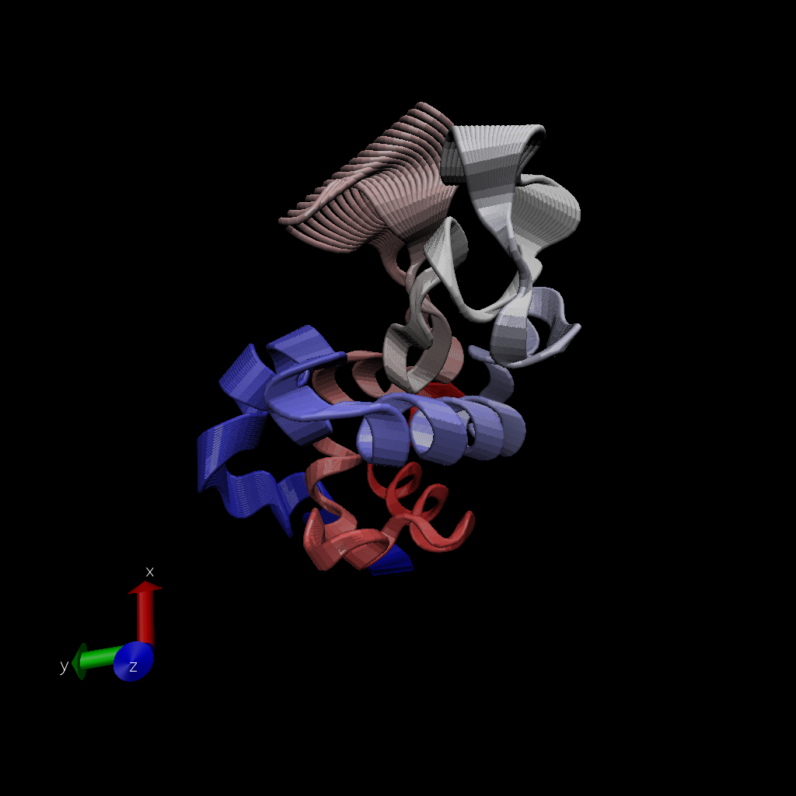

\#Comparative analysis of protein structures

using the bio3d package

```{r}
library(bio3d)

```

```{r}
pdb <- read.pdb("1hel")
pdb
```

Let's use a bioinformatics method called NMA (Normal Mode Analysis) to predict the dynamics (flexibility) o this enzyme

```{r}
modes <- nma(pdb)
plot(modes)
```

Make a "move" of its predicted motion. We odten call this a "trajectory".

```{r}
mktrj(modes, file="nma.pdb")
```



#Analysis of ADK

>Q10. Which of the packages above is found only on BioConductor and not CRAN?

msa

>Q11. Which of the above packages is not found on BioConductor or CRAN?:


>Q12. True or False? Functions from the devtools package can be used to install packages from GitHub and BitBucket?

TRUE


```{r}
library(bio3d)
#install.packages("httr")
library(httr)

aa <- get.seq("1ake_A")
```

>Q13. How many amino acids are in this sequence, i.e. how long is this sequence? 

214

```{r}
# Blast or hmmer search 
b <- blast.pdb(aa)
```

```{r}
# Plot a summary of search results
hits <- plot(b)
```

```{r}
# List out some 'top hits'
head(hits$pdb.id)
```

```{r}
hits <- NULL
hits$pdb.id <- c('1AKE_A','4X8M_A','6S36_A','6RZE_A','4X8H_A','3HPR_A','1E4V_A','5EJE_A','1E4Y_A','3X2S_A','6HAP_A','6HAM_A','4K46_A','4NP6_A','3GMT_A','4PZL_A')
```

```{r}
# Download releated PDB files
files <- get.pdb(hits$pdb.id, path="pdbs", split=TRUE, gzip=TRUE)
```

Multiple structure alignment
```{r}
# Align releated PDBs
pdbs <- pdbaln(files, fit = TRUE)#, exefile="msa")
```

```{r}
# Vector containing PDB codes for figure axis
ids <- basename.pdb(pdbs$id)

# Draw schematic alignment
plot(pdbs, labels=ids)
```

#Let's do some PCA

```{r}
# Perform PCA
pc.xray <- pca(pdbs)
plot(pc.xray)
```

```{r}
# Calculate RMSD
rd <- rmsd(pdbs)

# Structure-based clustering
hc.rd <- hclust(dist(rd))
grps.rd <- cutree(hc.rd, k=3)

plot(pc.xray, 1:2, col="grey50", bg=grps.rd, pch=21, cex=1)
```

#Optional further visualization

```{r}
# Visualize first principal component
pc1 <- mktrj(pc.xray, pc=1, file="pc_1.pdb")
pc1

```

```{r}
#install.packages("ggplot2")
#install.packages("ggrepel")
```


```{r}
#Plotting results with ggplot2
library(ggplot2)
library(ggrepel)

df <- data.frame(PC1=pc.xray$z[,1], 
                 PC2=pc.xray$z[,2], 
                 col=as.factor(grps.rd),
                 ids=ids)

p <- ggplot(df) + 
  aes(PC1, PC2, col=col, label=ids) +
  geom_point(size=2) +
  geom_text_repel(max.overlaps = 20) +
  theme(legend.position = "none")
p
```

#Normal Mode Analysis

```{r}
# NMA of all structures
modes <- nma(pdbs)
```

```{r}
plot(modes, pdbs, col=grps.rd)
```

>Q14. What do you note about this plot? Are the black and colored lines similar or different? Where do you think they differ most and why?

The black and colored lines are different. Though they are a little similar (mostly peaks/valleys in the same x-axis area), the colored lines generally have much higher y-axis values. The colored peaks are taller than the black lines. They are most different in the 125-160 residue area. This is probably the area in which there is some type of flexibility (motion).