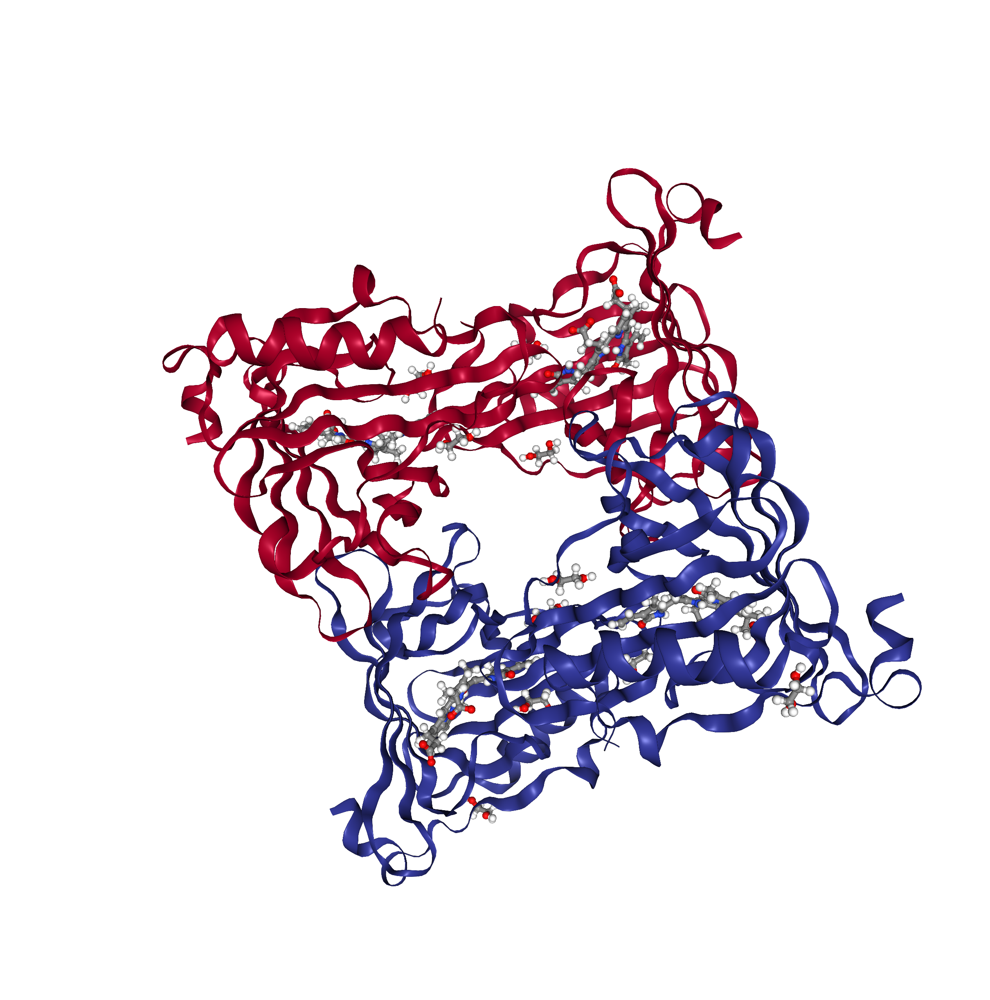

Load in Bio3D

```{r}
library(bio3d)
library(plyr)
library(ggplot2)
```

> > Q7. Generate a sequence identity based heatmap

Let's read our fasta file into R!

```{r}
fast <- read.fasta("muscle-I20211203-024209-0985-8072325-p2m.clw.fst")
clust <- read.csv("muscle-I20211203-024209-0985-8072325-p2m.clw")
```

```{r}
f <- as.vector(fast)
```

```{r}
heatmapdata <- seqidentity(fast)

heatmapdata
```

```{r}
heatmap <- heatmap(heatmapdata, margins = c(6,6))
```

> > Q8. Top 3 unique hits for similar atomic resolution structures

```{r}
#We can combine our sequences
conseq <- consensus(fast)
conseq
```

```{r}
conseq2 <- conseq$seq
conseq2
```

```{r}
blastResults <- blast.pdb(conseq2, database = "pdb")

blastResults$hit.tbl
```

1.  Chain A, Sandercyanin Fluorescent Protein (5EZ2_A) Evalue : 4.94e-08
    ; sequence identity : 26.404 Source organism : Sander vitreus
    (walleye) experimentalTechnique : X-Ray Diffraction Resolution :
    1.85A
2.  Chain A, Apolipoprotein D (2HZQ_A) Evalue : 1.82e-05 ; sequence
    identity : 27.083 Source organism : Homo sapiens (human)
    experimentalTechnique : X-Ray Diffraction Resolution : 1.8A
3.  Chain A, Major urinary protein 2 (PDB : 2NND_A) Evalue : 1.80e-04 ;
    sequence identity : 23.684 Source organism : Mus musculus (house
    mouse) experimentalTechnique : X-Ray Diffraction Resolution : 1.6A

> > Q9. Generate molecular figure

I will use NGL viewer online

This is for our first result, 5EZ2_A



This structure only had a 26.404% sequence identity compared to our "novel" protein, it is likely that this structure is not very similar to our novel one. There may be a few conserved residues and base strucutre parts but as a whole will be different from ours. 

>> Q10. Perform a "Target" search of chEMBEL w/ our novel sequence. Are there any Target Associated Assays and ligand efficiency data reported that may be useful starting points for exploring potential inhibition of your novel protein?

This was our initail results page for our chEMBEL search
https://www.ebi.ac.uk/chembl/g/#search_results/assays/query=MKWVWALLLLAALGSGRAERDCRVSSFRVKENFDKARFSGTWYAMAKKDPEGLFLQDNIVAEFSVDETGQ%20MSATAKGRVRLLNNWDVCADMVGTFTDTEDPAKFKMKYWGVASFLQKGNDDHWIIDTDYDTYAVQYSCRL%20LNLDGTCADSYSFVFSRDPNGLPPEAQRIVRQRQEELCLARQYRLIVHNGYCDGRSERNLL

There were 1,383,553 assays found, and when searched for target associated, there were 20,346 results from those assays. CHEMBL3881277 (https://www.ebi.ac.uk/chembl/assay_report_card/CHEMBL3881277/) looked interesting as it had target levels of decrease in heme oxygenase protein expression labels that could be related to our retinol binding protein.

CHEMBL1293256 has to do with the ligand thrombopoietin, and had assays measuring its potency and functionality.
https://www.ebi.ac.uk/chembl/target_report_card/CHEMBL1293256/
